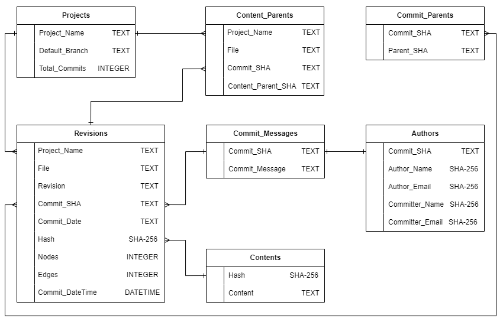

# Opening the Valve on Pure Data: usage of the database

In the following sections, we explain the usage of our dataset. Our dataset is available at https://archive.org/details/Opening_the_Valve_on_Pure_Data as a file titled: **dataset.tar.gz**. 

We have also made the mirrored PD repositories available in the same archive.org link, the file is titled **pd_mirrored.tar.gz**.

**Please make necessary modification to the folder structure in the scripts to save the files in your desired locations and run `pip install -r requirements.txt` to install the necessary dependencies**

# Structure of our Dataset

Our dataset has seven tables: Revisions, Contents, Authors, Commit_Messages, Commit_Parents, Content_parents, and Projects. The schema of our dataset is shown below:

```
CREATE TABLE "Revisions" (
  "Project_Name" TEXT,
  "File" TEXT,
  "Revision" TEXT,
  "Commit_SHA" TEXT,
  "Commit_Date" TEXT,
  "Hash" TEXT,
  "Nodes" INTEGER,
  "Edges" INTEGER,
  "Commit_DateTime" DATETIME);
CREATE TABLE "Contents" (
  "Hash" TEXT,
  "Content" TEXT
);
CREATE UNIQUE INDEX "ix_Hashes_index" ON "Contents" ("Hash");
CREATE TABLE "Projects" (
"Project_Name" TEXT,
  "Default_Branch" TEXT,
  "Total_Commits" INTEGER
);
CREATE TABLE "Authors" (
"Commit_SHA" TEXT,
  "Author_Name" TEXT,
  "Author_Email" TEXT,
  "Committer_Name" TEXT,
  "Committer_Email" TEXT
);
CREATE TABLE "Commit_Messages" (
"Commit_SHA" TEXT,
  "Commit_Message" TEXT
);
CREATE TABLE "Commit_Parents" (
"Commit_SHA" TEXT,
  "Parent_SHA" TEXT
);
CREATE TABLE "Content_Parents" (
"Project_Name" TEXT,
  "File" TEXT,
  "Commit_SHA" TEXT,
  "Content_Parent_SHA" TEXT
);
CREATE INDEX "ix_Revisions_Hashes_index" ON "Revisions" ("Hash");
CREATE INDEX "ix_Revisions_Projects_index" ON "Revisions" ("Project_Name");
CREATE INDEX "ix_Revisions_Commit_index" ON "Revisions" ("Commit_SHA");
CREATE INDEX "ix_Projects_index" ON "Projects" ("Project_Name");
CREATE INDEX "ix_Authors_index" ON "Authors" ("Commit_SHA");
CREATE INDEX "ix_Commit_Messages_index" ON "Commit_Messages" ("Commit_SHA");
CREATE INDEX "ix_Commit_Parents_index" ON "Commit_Parents" ("Commit_SHA");
CREATE INDEX "ix_Content_Parents_index" ON "Content_Parents" ("Commit_SHA");
```


<center>Fig: Schema of our dataset</center>
<br>
<br>

# Usage of our database (database.db)

## 1. Access the dataset
At first, download the dataset file titled: **dataset.tar.gz** available at https://archive.org/details/Opening_the_Valve_on_Pure_Data by using the following command.

`wget -c https://archive.org/download/Opening_the_Valve_on_Pure_Data/dataset.tar.gz`

**Please note that the size of the dataset.tar.gz file is is ~1.0 GB**, so make sure you have necessary space in your system. After that, move the file in the same directory as this README file and unzip the file using the command: `tar -xzf dataset.tar.gz`. This command will unzip the tar file and extract the `database.db` file.

## 2. How to load the sqlite command line interface
After downloading and extracting our database you can query it by using sqlite3 command line tools. **Please note that the size of the extracted database is ~21.3GB**, so make sure you have necessary space in your system. You can use sqlite3 (>=3.7.17) to query our database. To load the sqlite3 command line tool and query our database, go to your command line and type `sqlite3 database.db`. This will open up a sqlite3 command line interface for querying our database. Then you can run your SQL queries directly from the command line. Some examples are given below. You can exit sqlite3 the command line interface by running `.exit` on the command line.

Additionally, you can follow [Example 2 of Step 9](#example-2-open-the-sqlite3-command-line-using-a-bash-script) to start the sqlite3 command line interface using our provided bash script.

## 3. Some sample queries

### Example 1: Load three projects with the highest commit count
```
SELECT Project_Name, Total_Commits 
FROM Projects 
ORDER BY Total_Commits DESC 
LIMIT 3;
```

### Example 2: Get all information about a PD file "sampler.pd" from project "zzsnzmn_puredata-sampler"
```
SELECT * 
FROM Revisions 
WHERE Project_Name = "zzsnzmn_puredata-sampler" AND File = "sampler.pd";
```

### Example 3: Get the parsed contents of the revision of a PD file "sampler.pd" from project "zzsnzmn_puredata-sampler" where the commit id of the revision is "a2f917add8664dc59ff285ddfb589bc5e9486503"

```
SELECT c.Content 
FROM Contents c 
JOIN Revisions r ON c.Hash = r.Hash 
WHERE r.Project_Name = "zzsnzmn_puredata-sampler" AND r.File="sampler.pd" AND r.Commit_SHA = "a2f917add8664dc59ff285ddfb589bc5e9486503";
```

Additionally, you can follow [Example 1 of Step 9](#example-1-get-the-contents-of-a-revision-of-a-pd-file-given-project-name-file-name-and-commit-sha-of-that-revision) to run this command directly using our helper script.

### Example 4: Get all authors of the project "zzsnzmn_puredata-sampler" who worked on the PD files
```
SELECT a.Author_Name 
FROM Authors a 
JOIN Revisions r ON a.Commit_SHA = r.Commit_SHA 
WHERE r.Project_Name = "zzsnzmn_puredata-sampler";
```

### Example 5: Get the commit messages of the unique commit IDs of the project "zzsnzmn_puredata-sampler"
```
SELECT DISTINCT(c.Commit_SHA), c.Commit_Message 
FROM Commit_Messages c 
JOIN Revisions r ON c.Commit_SHA = r.Commit_SHA 
WHERE r.Project_Name = "zzsnzmn_puredata-sampler";
```

### Example 6: Get three projects with the highest number of PD files and show their total commit count

```
SELECT
    p.Project_Name,
    p.Total_Commits
FROM
    Projects p
JOIN (
    SELECT
        Project_Name,
        COUNT(DISTINCT File) AS File_Count
    FROM
        Revisions
    GROUP BY
        Project_Name
    ORDER BY
        File_Count DESC
    LIMIT 3
) r ON p.Project_Name = r.Project_Name;
```

## 4. How to get the JSON of a revision of a PD file "sampler.pd" from project "zzsnzmn_puredata-sampler" where the commit id of the revision is "a2f917add8664dc59ff285ddfb589bc5e9486503" using our database
```
SELECT c.Content 
FROM Contents c 
JOIN Revisions r ON c.Hash = r.Hash 
WHERE r.Project_Name = "zzsnzmn_puredata-sampler" AND r.File="sampler.pd" AND r.Commit_SHA = "a2f917add8664dc59ff285ddfb589bc5e9486503";
```

## 5. How to download and unzip the git repos (pd_mirrored.tar.gz)
**Note that the pd_mirrored.tar.gz file is ~242.5 GB in size**. Please make sure you have sufficient space in your system before unzipping the contents of this tar file.

```
# At first, go to your desired directory where you want to download the tar file of the mirrored git repositories
cd <destination_folder>

# Then, download the tar file of the mirrored git repositories
wget -c https://archive.org/download/Opening_the_Valve_on_Pure_Data/pd_mirrored.tar.gz

# Then run the following command to unzip the contents of the tar file
tar -xzf pd_mirrored.tar.gz
```

## 6. How to get the raw contents of a PD file revision "sampler.pd" from project "zzsnzmn_puredata-sampler" where the commit id of the revision is "a2f917add8664dc59ff285ddfb589bc5e9486503" using `git show`

After unzipping the mirrored git repositories:

```
# Go to the project folder
cd pd_mirrored/zzsnzmn_puredata-sampler

# Then run the following command
git show a2f917add8664dc59ff285ddfb589bc5e9486503:"sampler.pd"
```

The format of this command is: 

`git show <commit_sha>:<revision_name>`

Note that, the *revision_name* used in the git show commands are stored in the `Revision` column of the `Revisions` table in our dataset.

## 7. How to manually parse the contents of a PD file

Our PD file parser is stored in the *parsing_the_PD_file_contents/parsers/pd/pdparser.py* file. We can pass a PD file manually to this parser and get the parsed contents of  the file. To get the parsed contents of a PD file, we can run the following command:

`python parsing_the_PD_file_contents/parse.py <pd_file_name>`

The output will be stored in the *parsing_the_PD_file_contents/example_PD_file_and_parsed_output* directory inside the file `example.json`.


## 8. Understanding the parsed contents

*parsing_the_PD_file_contents/example_PD_file_and_parsed_output/example.json* is an example parsed content of a PD file. We are saving information about nodes and edges in a JSON format in our database. 

- "edges" field represents the number of total connections or edges
- "nodes" field represents the number of total objects or nodes in a PD file
- "node_types" is a dictionary which contains the count of the different types of nodes
- "all_objects" is an array containing the details of each object
- "connections" stores the edge information including source and destination object IDs and the inlet and outlet numbers.


## 9. How to use our provided scripts to run the sql queries easily 

We have provided three helper scripts for the database inside the *helper_scripts_for_the_database* directory. Please put the helper scripts (.sh files) in the same directory as the database.

- `show_file.sh`: This script retrieves the actual content of a PD file by joining the `Revisions` and `Contents` tables on the SHA-256 hash value of the content.

- `sqlite.sh`: This script opens the sqlite3 command line interface.

- `sqlite_query.sh`: This script runs a query directly without doing any additional steps. Pass the SQL query as a parameter to this script, and you can see the results directly in your command prompt.

### Example 1: Get the contents of a revision of a PD file given Project Name, File Name, and Commit SHA of that revision

You can use our provided script *helper_scripts_for_the_database/show_file.sh* to get the contents of the revision of a PD file. Run the query below from your command line after inserting your project name, file name, and commit_sha of the revision. You can find this information from the `Revisions` table.

Command: `./show_file.sh <Project_Name> <File> <Commit_SHA>`

For example:

`./show_file.sh zzsnzmn_puredata-sampler sampler.pd a2f917add8664dc59ff285ddfb589bc5e9486503`

### Example 2: Open the sqlite3 command line using a bash script
Run our script *helper_scripts_for_the_database/sqlite.sh* to open the sqlite3 command line interface for querying our database.

Command: `./sqlite.sh`


### Example 3: Run a query directly using a bash script
Run our script *helper_scripts_for_the_database/sqlite_query.sh* to open the sqlite3 command line interface for querying our database.

Command: `./sqlite_query.sh <query>`

For example:

`./sqlite_query.sh "Select * from projects where project_name = 'zzsnzmn_puredata-sampler';"`

# Replicating our work
If you want to replicate our work or use the scripts to generate your own results, please follow the instructions provided in the `.md` files inside the subdirectories. The locations of the instruction files are mentioned below:

- To collect the PD project names, please follow the instructions in `methodology/Project_Name_Collection/project_name_collection.md`.

- To extract the commit-related information (author, commit messages, commit parents, content parents, and total commits), please follow the instructions in `methodology/Commit_Information_Retrieval/commit_information_retrieval.md`.

- For extracting the revision history of each PD file and populating the database, please follow the instructions provided in `methodology/Revision_History_Extraction_and_Populating_the_Database/revision_history_and_populate_the_db.md`.

- To reproduce the values used in this paper for the data analysis and results sections, please follow the instructions in `data_analysis_and_results\data_analysis_and_results.md`.

# Citing our dataset

Please cite our dataset if you use it in an academic work:

```
@inproceedings{islam2024puredata,
  title = {{Opening the Valve on Pure-Data: Usage Patterns and Programming Practices of a Data-Flow-Based Visual Programming Language}},
  author = {Islam, Anisha and Eng, Kalvin and Hindle, Abram},
  booktitle={MSR},
  year={2024},
  organization={IEEE}
},
```

